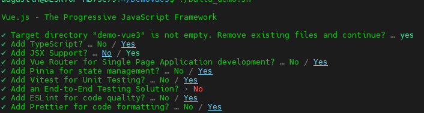

# Setup

To follow demo step by step: You can run each script in vue-demo-scripts individually to follow progression.

- To go to step 4, re-run all scripts from 0 to 4

```bash
./vue-demo-scripts/0_vuejs_setup.sh
./vue-demo-scripts/1_...
./vue-demo-scripts/2_...
```

- To get the complete version:

```bash
./build_demo.sh
```

## Answers to give




<br/>

# Steps

### Script 0

Setup the core structure

- tsconfig
- external library (Vuetify, icons)
- Set custom Themes (Light & Dark)
- Set default layout (Navbar, Sidebar, Footer, Main Content)
- Install dependencies

### Script 1

- Add an exemple of how works binding between HTML templates & JS Data


### Script 2

- Factorize the previous exemple as a reusable component

### Script 3

- Define a more generic component to draw Cards with props & default slots

### Script 4

- Improve previous component to use named slots

### Script 5

- Use previous component to create a more complex design

### Script 6

- Create a component to show how works reactivity

### Script 7

- Implement basics of Vue Router functionnalities
  - Define routes & views
  - Move to another page (statically & dynamicaly)
  - Read URL Path, Query params
  - Basic middleware to manage page routing

### Script 8

- Implement nested routing with childs

### Script 9 

- Implement store exemple with SnackBar component

### Script 9.1

- Implement API Configuration, Calls, Interceptor request/response

### Script 9.2

Composition API with VueUse


### Coming later

- Usage of Composition API with VueUse
- Define your own Composables (Api, Stores,...)